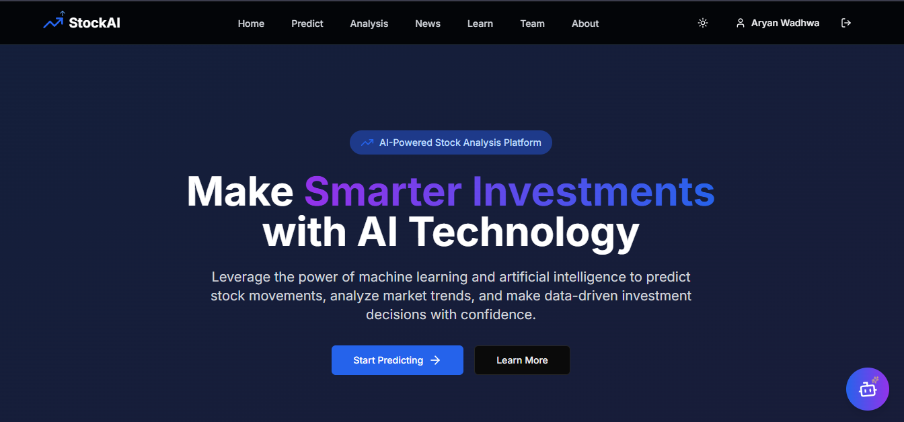
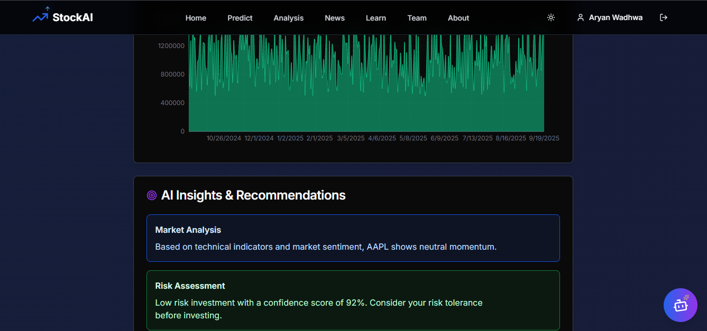
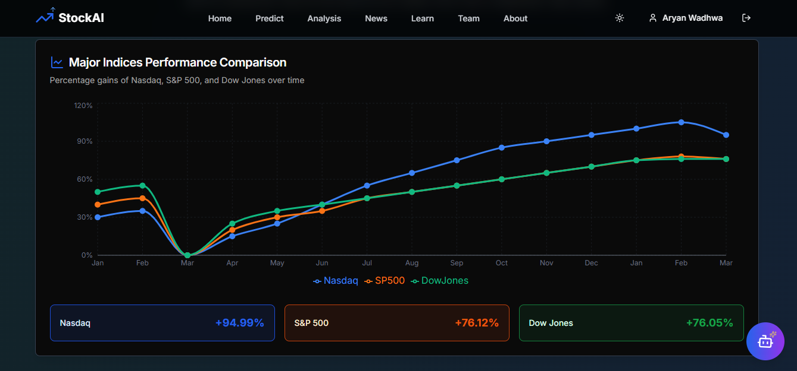
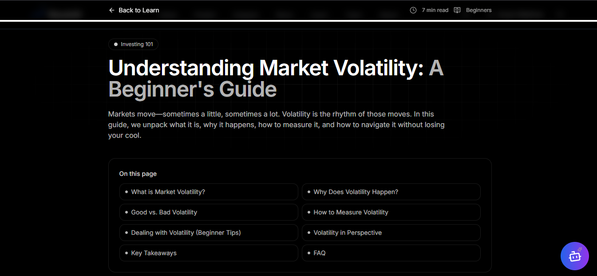
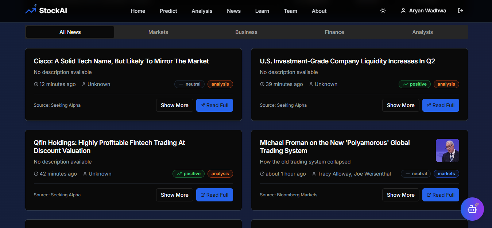

# StockAI - Advanced Stock Prediction & Analysis Platform 

[](https://stocks-prediction-analysis.vercel.app/)
[](https://choosealicense.com/licenses/mit/)
[](https://nextjs.org/)
[](https://www.python.org/downloads/)
[](https://tensorflow.org/)

> **Live Demo:** [https://stocks-prediction-analysis.vercel.app/](https://stocks-prediction-analysis.vercel.app/) 

---

##  What is StockAI?

StockAI is a simple, modern platform for stock prediction and analysis. It combines deep learning (LSTM) for price forecasting, technical analysis tools, and an AI-powered chat advisor all in a clean, responsive web app.

---

##  Features

- **AI Predictions:** LSTM neural networks forecast stock prices with confidence scores.
- **Technical Analysis:** RSI, MACD, Bollinger Bands, and more.
- **Interactive Charts:** Visualize trends, signals, and portfolio performance.
- **AI Stock Advisor:** Chat with AI for investment tips and insights.
- **Real-Time Data:** Live prices, news, and market sentiment.
- **Responsive Design:** Works great on desktop and mobile.

---

## Project Overview

- **Homepage:** Overview of features and benefits.  
  

- **Dashboard:** Personalized portfolio, market data and AI insights.  
  

- **Predictions:** Search stocks, view forecasts, and technical indicators.  
  

- **Learning Resources:** Educational content and blogs on stock trading and AI.  
  

- **Stocks News and Sentiment:** Latest news and sentiment analysis.  
  

---
### Project Structure

```/
├── project/
│   ├── app/
│   │   ├── page.tsx
│   │   ├── dashboard/
│   │   ├── predictions/
│   │   ├── advisor/
│   │   ├── analytics/
│   │   ├── portfolio/
│   │   ├── news/
│   │   |── globals.css
|   |   └── layout.tsx
│   ├── components/
│   │   ├── ui/
│   │   │   ├── button.tsx
│   │   │   ├── card.tsx
│   │   │   ├── input.tsx
│   │   │   ├── chart.tsx
│   │   │   └── dialog.tsx
│   │   ├── charts/
│   │   │   ├── StockChart.tsx
│   │   │   ├── PredictionChart.tsx
│   │   │   ├── TechnicalChart.tsx
│   │   │   └── PortfolioChart.tsx
│   │   ├── prediction/
│   │   │   ├── PredictionCard.tsx
│   │   │   ├── ConfidenceScore.tsx
│   │   │   ├── RiskAssessment.tsx
│   │   │   └── SignalIndicator.tsx
│   │   ├── advisor/
│   │   │   ├── ChatInterface.tsx
│   │   │   ├── MessageBubble.tsx
│   │   │   ├── SuggestionCard.tsx
│   │   │   └── AnalysisReport.tsx
│   │   └── layout/
│   │       ├── Header.tsx
│   │       ├── Sidebar.tsx
│   │       ├── Footer.tsx
│   │       └── MobileNav.tsx
│   ├── lib/
│   │   ├── utils.ts
│   │   ├── api.ts
│   │   ├── ml-utils.ts
│   │   ├── validators.ts
│   │   ├── constants.ts
│   │   └── types.ts
│   ├── hooks/
│   │   ├── useStockData.ts
│   │   ├── usePredictions.ts
│   │   ├── usePortfolio.ts
│   │   └── useWebSocket.ts
│   ├── public/
│   │   ├── images/
│   │   ├── icons/
│   │   └── favicon.ico
│   ├── styles/
│   │   └── globals.css
│   ├── package.json
│   ├── next.config.js
│   ├── tailwind.config.ts
│   ├── tsconfig.json
│   └── .env.local (gitignored)
│
├── ML Backend / notebooks:
│   ├── stock_prediction_lstm.ipynb
│   ├── technical_analysis.ipynb
│   ├── model_training.py
│   └── data_preprocessing.py
│
├── README.md
├── LICENSE
├── vercel.json
└── requirements.txt
```
## Quick Start

1. **Clone & Install**
   ```bash
   git clone https://github.com/Aryanwadhwa14/Stocks-prediction-analysis.git
   cd Stocks-prediction-analysis/project
   npm install
   # or
   yarn install
   # or
   pnpm install
   ```

2. **Environment configuration:**
   ```bash
   # Create environment file
   cp .env.example .env.local
   
   # Add your API keys to .env.local:
   NEXT_PUBLIC_STOCK_API_KEY=your_stock_api_key
   NEXT_PUBLIC_BASE_URL=http://localhost:3000
   DATABASE_URL=your_database_url (if using database)
   ```

3. **Run the development server:**
   ```bash
   npm run dev
   # or
   yarn dev
   # or
   pnpm dev
   ```

   Open [http://localhost:3000](http://localhost:3000) in your browser to see the application.

### ML Backend Setup

1. **Navigate to project directory:**
   ```bash
   cd Stocks-prediction-analysis/project
   ```

2. **Install Python dependencies (if using local ML models):**
   ```bash
   pip install numpy pandas matplotlib scikit-learn tensorflow yfinance requests
   ```

3. **For Jupyter notebook exploration:**
   ```bash
   pip install jupyter notebook
   jupyter notebook
   # Open stock_prediction_lstm.ipynb in the browser
   ```

**Note**: The main application integrates ML predictions via API services and doesn't require a separate Python backend for basic functionality.

## 🛠️ Technology Stack

### Frontend (Next.js App)
- **Framework**: Next.js 14+ with App Router
- **Language**: TypeScript for type safety
- **Styling**: Tailwind CSS for utility-first styling
- **UI Components**: shadcn/ui for modern, accessible components
- **Charts**: Recharts for interactive financial charts
- **State Management**: React Context/useState for component state
- **Icons**: Lucide React for consistent iconography
- **Animations**: Framer Motion for smooth transitions

### Backend & ML Integration
- **API Routes**: Next.js API routes for server-side functionality
- **External APIs**: Fintech graded apps Finance API, Alpha Vantage for stock data,
Nasdaq and other market data sources
- **ML Models**: TensorFlow.js for client-side predictions or external ML APIs
- **AI Integration**: Google API for investment advisory
- **Data Processing**: Client-side processing with JavaScript/TypeScript
- **Real-time Data**: WebSocket connections for live market data

### Infrastructure & Deployment
- **Frontend Hosting**: Vercel for optimal Next.js deployment
- **Database**: Vercel Postgres or external database (if needed)
- **Environment Management**: Vercel environment variables
- **CDN**: Vercel Edge Network for global content delivery
- **Analytics**: Vercel Analytics for performance monitoring
- **Domain**: Custom domain support through Vercel

## ML Model Details

### LSTM Architecture
```python
model = Sequential([
    LSTM(50, return_sequences=True, input_shape=(sequence_length, features)),
    Dropout(0.2),
    LSTM(50, return_sequences=True),
    Dropout(0.2),
    LSTM(50),
    Dropout(0.2),
    Dense(25),
    Dense(1)
])
```

### Technical Indicators
- **RSI (Relative Strength Index)**: Momentum oscillator (0-100)
- **MACD**: Moving Average Convergence Divergence
- **Bollinger Bands**: Volatility and price level indicator
- **SMA/EMA**: Simple and Exponential Moving Averages
- **Volume Analysis**: On-Balance Volume (OBV)

### Performance Metrics
- **RMSE**: Root Mean Square Error
- **MAE**: Mean Absolute Error
- **MAPE**: Mean Absolute Percentage Error
- **Directional Accuracy**: Prediction of price direction
- **Sharpe Ratio**: Risk-adjusted returns

##  Features Showcase

### Landing Page
- Hero section with value proposition
- Feature highlights and benefits
- Live prediction preview
- Call-to-action for user registration

### Dashboard
- Portfolio overview and performance
- Real-time market data feed
- Quick access to top predictions
- News and market sentiment analysis

### Prediction Interface
- Stock symbol search and selection
- Interactive prediction charts
- Confidence intervals and risk metrics
- Historical accuracy display

### AI Advisor Chat
- Natural language investment queries
- Contextual market analysis
- Portfolio optimization suggestions
- Educational content and explanations

##   Dev Dependencies

```json
{
  "dependencies": {
    "next": "^14.0.0",
    "react": "^18.2.0",
    "react-dom": "^18.2.0",
    "typescript": "^5.2.0",
    "tailwindcss": "^3.3.0",
    "@radix-ui/react-*": "^1.0.0",
    "class-variance-authority": "^0.7.0",
    "clsx": "^2.0.0",
    "tailwind-merge": "^1.14.0",
    "recharts": "^2.8.0",
    "lucide-react": "^0.290.0",
    "framer-motion": "^10.16.0"
  },
  "devDependencies": {
    "@types/node": "^20.8.0",
    "@types/react": "^18.2.0",
    "@types/react-dom": "^18.2.0",
    "eslint": "^8.52.0",
    "eslint-config-next": "^14.0.0",
    "autoprefixer": "^10.4.16",
    "postcss": "^8.4.31"
  }
}
```

### Stock Data
```
GET /api/stocks/{symbol}           # Get stock information
GET /api/stocks/{symbol}/history   # Historical price data
GET /api/stocks/{symbol}/predict   # Get predictions
```

### Predictions
```
POST /api/predict                  # Generate new prediction
GET /api/predictions/{id}          # Get prediction details
GET /api/predictions/batch         # Bulk predictions
```

### AI Advisor
```
POST /api/advisor/chat            # Chat with AI advisor
GET /api/advisor/suggestions      # Get recommendations
POST /api/advisor/analyze         # Analyze portfolio
```

## Security Features

- **API Rate Limiting**: Prevents abuse and ensures fair usage
- **Input Validation**: Comprehensive data validation and sanitization
- **CORS Configuration**: Secure cross-origin resource sharing
- **Environment Variables**: Secure API key management
- **Error Handling**: Graceful error handling and user feedback

## Responsive Design

- **Mobile-First**: Optimized for mobile devices
- **Tablet Support**: Enhanced experience on tablets
- **Desktop**: Full-featured desktop interface
- **Touch-Friendly**: Intuitive touch interactions
- **Accessibility**: WCAG compliance and screen reader support

## Disclaimers

- **Educational Purpose**: This platform is for educational and research purposes only
- **Not Financial Advice**: Predictions should not be considered as financial advice
- **Market Risk**: All investments carry risk of loss
- **Data Accuracy**: While we strive for accuracy, data may have delays or errors
- **Past Performance**: Historical performance doesn't guarantee future results

## Roadmap

### Phase 1 (Current)
- [x] LSTM stock prediction model
- [x] Web interface with Next.js
- [x] AI advisor integration
- [x] Technical analysis tools

### Phase 2 (In Progress)
- [x] Real-time WebSocket data feeds
- [x] Advanced portfolio management
- [ ] Social trading features

### Phase 3 (Planned)
- [ ] Options and derivatives prediction
- [ ] Cryptocurrency support
- [ ] Multi-language support
- [ ] Advanced risk management tools

## 🤝 Contributing

We welcome contributions! Here's how to get started:

1. **Fork the repository**
2. **Create a feature branch** (`git checkout -b feature/amazing-feature`)
3. **Make your changes** and add tests
4. **Commit your changes** (`git commit -m 'Add amazing feature'`)
5. **Push to branch** (`git push origin feature/amazing-feature`)
6. **Create a Pull Request**

### Development Guidelines
- Follow TypeScript best practices
- Write tests for new features
- Update documentation as needed
- Follow the existing code style
- Add meaningful commit messages

##  Support & Contact

- **GitHub Issues**: [Report bugs or request features](https://github.com/Aryanwadhwa14/Stocks-prediction-analysis/issues)
- **Email**: [Aryan Wadhwa](mailto:aryanwadhwa911@gmail.com)
- **Documentation**: Check the docs folder for detailed guides

## Author

**Aryan Wadhwa**
- GitHub: [Aryanwadhwa14](https://github.com/Aryanwadhwa14)
- LinkedIn: [Aryan Wadhwa](https://www.linkedin.com/in/aryan-wadhwa-073727252/)

**Dipesh Gupta**
- GitHub: [Dipesh_Gupta](https://github.com/dipesh-gupta03)
- LinkedIn: [Dipesh Gupta](https://www.linkedin.com/in/dipesh-gupta-512964295/)


## Acknowledgments

- **TensorFlow Team**: For the excellent ML framework
- **Vercel**: For seamless deployment platform
- **shadcn/ui**: For beautiful UI components
- **Yahoo Finance**: For reliable market data
- **Google Gemini**: For AI advisor capabilities
- **Open Source Community**: For inspiration and resources

## License

This project is licensed under the MIT License - see the [LICENSE](LICENSE) file for details.

---

<div align="center">

** Star this repository if you find it helpful!**

[**🌐 Live Demo**](https://stocks-prediction-analysis.vercel.app/) • [**📚 Documentation**](./docs) • [**Report Bug**](https://github.com/Aryanwadhwa14) • [**✨ Request Feature**](https://github.com/Aryanwadhwa14/Stocks-prediction-analysis/issues)

</div>

---

> **Note**: This platform is only for educational purpose and continuously evolving. Check back for updates and new features!
